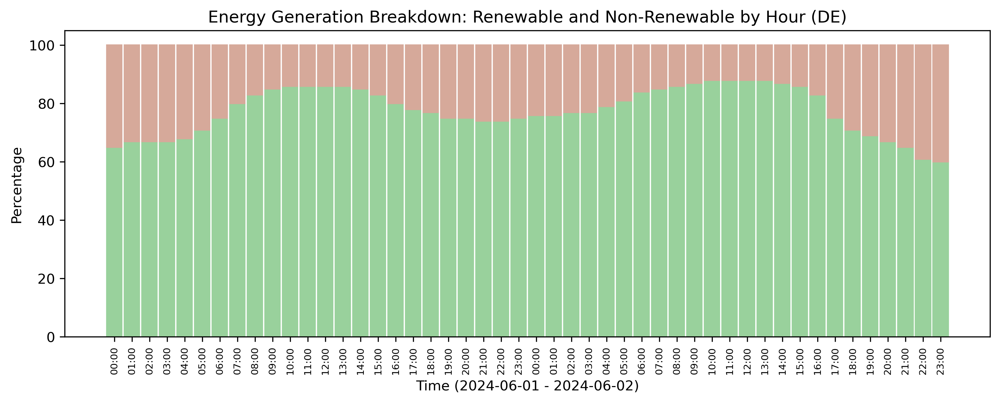
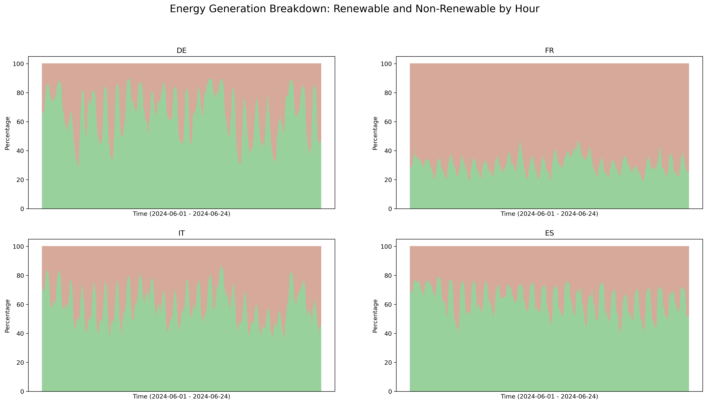
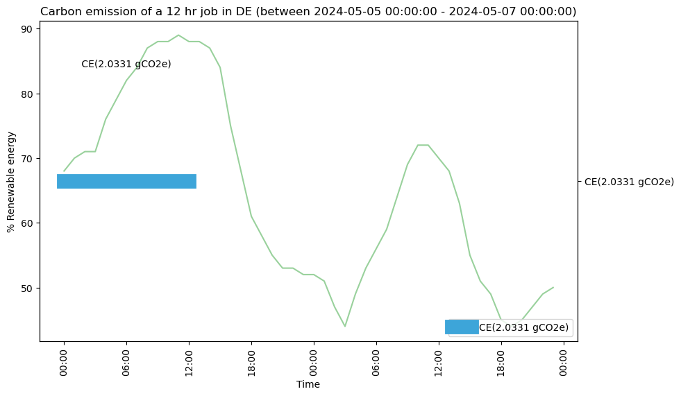
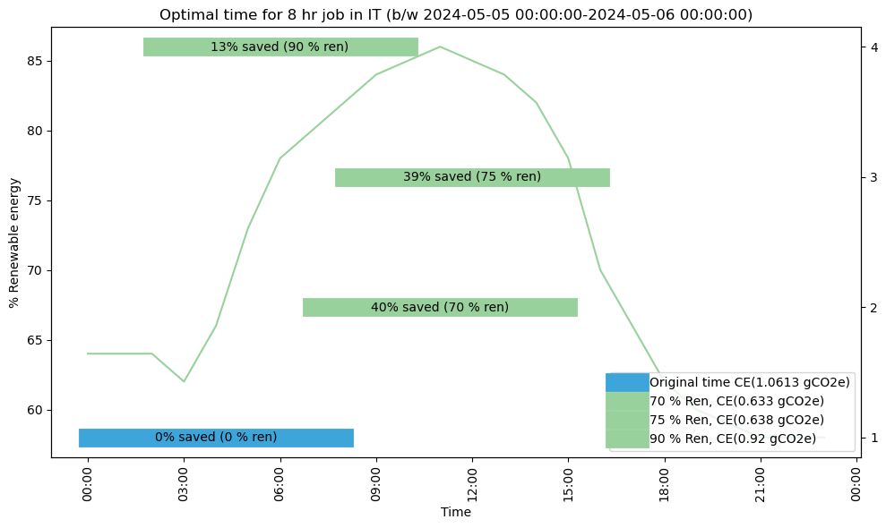

Introduction
============

We often overlook the environmental impact of our computations. However, as our dependency on digital services grows, their environmental impact becomes increasingly significant. This impact is typically measured in terms of carbon footprint, which refers to the total amount of CO2 emitted directly and indirectly as a result of an activity. It is measured in tonnes of CO2 equivalent (CO2e). 

Advances in hardware technology have enabled us to train deep learning models with impressive accuracy. But this comes at a cost : increased consumption as they requires long training periods resulting in an greater environment impact. has also resulted in a increase in the energy consumption as they takes long hours to train leading to a higher environmental impact. For instance, training  BERT_base, a  language model with 110 million parameters, on 64 Tesla V100 GPS takes approximately 79 hours generates a carbon footprint of 1438 pounds of CO2e and costs roughly equivalent to one trans-American flight. 

In 2020, the  total greenhouse gas (GHG) emissions from the Information and Communication Technology (ICT) sector were estimated to be around 764 million tonnes of CO2e. This accounted for approximately 1.4% of global GHG emissions that year. With the continued expansion of the sector, these emissions are expected to rise, potentially influencing our global efforts to achieve net-zero carbon emissions in either a positive or negative way. It is thus crucial to raise awareness among researchers and industry professionals about the carbon emissions generated by their computations and to explore ways to reduce them.

The carbon footprint of a computer depends on two main factors : its hardware specifications and the power it consumes. This makes calculating carbon emission somewhat challenging, as it requires gathering and analyzing this data. 

The `codegreen-core` package is a comprehensive tool that enables users to calculate the carbon emissions of a computational task and provides strategies for minimizing those emissions. 

Features of `codegreen-core`
-----------------------------

**Gather energy production data**

Energy is produced from multiple sources, some of these sources are non-renewable, such as fossil fuels and coal, and others are renewable, like wind and solar. The combination of energy produced from different sources (or the energy mix) varies from country to country and season to season. The amount of carbon emissions generated from energy production depends on this energy mix. When more energy is derived from renewable sources, carbon emissions are lower, making the energy more 'green.' (and vice versa). This relationship is measured by carbon intensity, which quantifies the amount of carbon dioxide emitted per unit of energy produced.

The codegreen-core package offers tools to collect time series data of the energy mix for various countries, which can also be used to calculate the carbon intensity of energy.

The figure above shows the percentage of energy generated from renewable (green) and non renewable (red) sources in Germany on 1st and 2nd June 2024.

This data helps analyze the energy production in a country over a period of time to  identify patterns and compare energy data for  multiple countries. 

The figure above shows the percentage of energy generated from renewable sources in four countries (Germany, France, Italy, and Spain) from June 1 to June 24, 2024.

An interesting observation is that the amount of green energy changes almost every hour. This presents two approaches to reducing carbon emissions:

- **Time Shifting**: Adjusting the timing of computations to align with periods of greater availability of green energy.
- **Location Shifting**: Moving computational tasks to locations that utilize more green energy.

**Calculating carbon emission of a computational task**

Given the time taken by a computational task, the location where it was performed, and the hardware specifications (number of cores/GPUs used and size of memory), the codegreen-core package provides an estimate of the carbon emissions produced by the task

The figure above shows the carbon emissions produced by a 12-hour computational task performed on 124 cores with 64 GB of memory in Germany

**Predicting the optimal time/location to start the computational task**

Given the approximate run time of the task, the hardware specifications, the location, and a specified criteria,  `codegreen-core`  predicts an optimal time based on energy production forecast data. It is designed to be fault-tolerant, and if no optimal time exists, the current time is returned. The user provides a criteria, such as the minimum percentage of renewable energy for the entire duration, which is used to predict the optimal time. 

The figure above shows the carbon emissions produced by an 8-hour computational task performed on 124 cores with 64 GB of memory in Italy, along with the potential savings in carbon emissions when the computation is started at suggested times using three different criteria (values of percentage renewable energy).

..
  // Challenges and future plans 
  // One of the main challenges is the availablilty of time series of energy produced using renewable and non renewable sources for different coutnreis. The current energy forecasts are also limited to the next 24 hours which limits the optimal time decitions within the next 24 hours.  In future, we plan to integrate data for Non EU counties as well as train predication models that can generate time series forecasts of for longer periods of time. 

Next step
----------

See the  Getting started guide for installation and setup.

References
-----------

- [1] J. Malmodin, N. Lövehagen, P. Bergmark, and D. Lundén, ‘ICT sector electricity consumption and greenhouse gas emissions – 2020 outcome’, Telecommunications Policy, vol. 48, no. 3, p. 102701, Apr. 2024, doi: 10.1016/j.telpol.2023.102701.
- [2] E. Strubell, A. Ganesh, and A. McCallum, ‘Energy and Policy Considerations for Deep Learning in NLP’, Jun. 05, 2019, arXiv: arXiv:1906.02243. Accessed: Oct. 11, 2024. [Online]. Available: http://arxiv.org/abs/1906.02243

